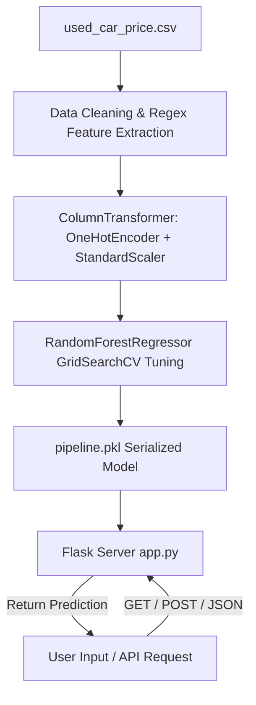

# 🚗 Car Price Prediction — AI/ML Web Application


An end-to-end Machine Learning web application designed to estimate used car resale values in India (in INR Lakhs) based on key vehicle attributes such as registration year, kilometers driven, fuel type, transmission, owner history, seating capacity, mileage, engine capacity, and maximum power.

Developed by **[Sanskar Jadhav](https://www.linkedin.com/in/jadhav-sanskar-kishor)**.

---

## 🌟 Key Features

- **High-Accuracy ML Model**: Built using Scikit-Learn `Pipeline`, `ColumnTransformer`, and `RandomForestRegressor` tuned via `GridSearchCV`.
- **88.8% $R^2$ Accuracy**: Evaluated with 5-fold cross-validation, achieving an **$R^2$ score of 0.8877** and **RMSE of 0.96 Lakhs**.
- **Modern Dark Glassmorphic UI**: High-contrast frosted glass interface with responsive grid layouts, custom SVG icons, and vibrant gradient highlights using Bootstrap 5 & custom CSS.
- **Real-Time Client Calculations**: Instant client-side calculation of vehicle age based on registration year input.
- **RESTful API Endpoint (`/api/predict`)**: Full programmatic JSON integration for third-party applications or mobile frontends.
- **Input Validation & Error Handling**: Server-side bounds checking for numerical inputs and clear error messages.
- **INR Currency Formatting**: Converts raw model output into formatted Indian Rupee strings (e.g., `₹ 5.55 Lakh (₹ 5,55,000)`).

---

## 📊 Model Architecture & Performance



### Performance Metrics Evaluation

| Metric | Score | Description |
| :--- | :---: | :--- |
| **$R^2$ Score** | **0.8877** (88.77%) | Proportion of variance in car prices explained by the model |
| **Root Mean Squared Error (RMSE)** | **0.9619 Lakhs** | Average prediction deviation from actual market price |
| **Model Estimator** | **Random Forest Regressor** | `n_estimators=50`, `min_samples_split=5` |

---

## 🛠️ Project Structure

```text
car-price-prediction/
├── app.py                  # Flask Web Server & REST API endpoints
├── pipeline.pkl            # Serialized ML Pipeline (Scikit-Learn 1.5.1)
├── predictor.ipynb         # Jupyter Notebook for EDA, data cleaning & model training
├── used_car_price.csv      # Used Car Dataset
├── requirements.txt        # Python dependency manifest
├── README.md               # Project documentation
└── templates/
    └── index.html          # Dark Glassmorphism Frontend Template
```

---

## 📡 REST API Documentation

### Predict Car Price
- **Endpoint**: `POST /api/predict`
- **Header**: `Content-Type: application/json`

#### Request Payload Example
```json
{
  "year": 2018,
  "kilometers_driven": 45000,
  "fuel_type": "Petrol",
  "transmission": "Manual",
  "owner_type": "First",
  "seats": 5,
  "mileage": 18.5,
  "engine": 1197,
  "power": 82.0
}
```

#### Successful Response (`200 OK`)
```json
{
  "success": true,
  "predicted_price_lakh": 5.55,
  "formatted_price": "₹ 5.55 Lakh (₹ 555,000)",
  "inputs": {
    "Year": 2018,
    "Kilometers_Driven": 45000,
    "Fuel_Type": "Petrol",
    "Transmission": "Manual",
    "Owner_Type": "First",
    "Seats": 5.0,
    "Mileage": 18.5,
    "Engine": 1197,
    "Power": 82.0
  }
}
```

---

## 🚀 Local Setup & Installation

### Prerequisites
- Python 3.9+
- Git

### Installation Steps

1. **Clone the Repository**:
   ```bash
   git clone https://github.com/sanskarjadhav015/car-price-prediction.git
   cd car-price-prediction
   ```

2. **Create a Virtual Environment**:
   ```bash
   python -m venv .venv
   # On Windows:
   .venv\Scripts\activate
   # On macOS/Linux:
   source .venv/bin/activate
   ```

3. **Install Dependencies**:
   ```bash
   pip install -r requirements.txt
   ```

4. **Run the Application**:
   ```bash
   python app.py
   ```

5. **Access in Browser**:
   Open [http://127.0.0.1:5000](http://127.0.0.1:5000) in your web browser.

---

## 👨‍💻 Developer Information

- **Developer**: Sanskar Jadhav
- **Portfolio**: [https://mern-portfolio-dun.vercel.app/](https://mern-portfolio-dun.vercel.app/)
- **GitHub**: [@sanskarjadhav015](https://github.com/sanskarjadhav015)
- **LinkedIn**: [Sanskar Kishor Jadhav](https://www.linkedin.com/in/jadhav-sanskar-kishor)
- **Email**: sanskarjadhav015@gmail.com
